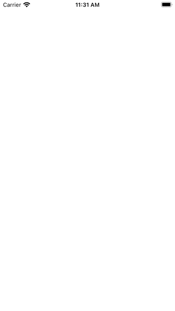

# ConfettiKit

A Swift package for shooting confetti. The implementation is heavily inspired by the blog post [Recreating iMessage Confetti](https://bryce.co/recreating-imessage-confetti/) by [@brycepauken](https://twitter.com/brycepauken).

## 📦 Adding the Package

ConfettiKit is distributed using [Swift Package Manager](https://www.swift.org/documentation/package-manager/). Install ConfettiKit in a project by adding it as a dependency in your Package.swift manifest or through “Package Dependencies” in project settings.

```swift
let package = Package(
    dependencies: [
        .package(url: "git@github.com:simonbs/ConfettiKit.git", from: "1.0.0")
    ]
)
```

## 🚀 Getting Started

Start by creating an instance of ConfettiView and pass an array of UIImage's when doing so. Make sure to add the view to your view hierarchy.

```swift
final class ViewController: UIViewController {
    private let confettiView: ConfettiView = {
        let images: [UIImage] = [...]
        let this = ConfettiView(images: images)
        this.translatesAutoresizingMaskIntoConstraints = false
        return this
    }()

    override func viewDidLoad() {
        super.viewDidLoad()
        view.addSubview(confettiView)
        NSLayoutConstraint.activate([
            confettiView.leadingAnchor.constraint(equalTo: view.leadingAnchor),
            confettiView.trailingAnchor.constraint(equalTo: view.trailingAnchor),
            confettiView.topAnchor.constraint(equalTo: view.topAnchor),
            confettiView.bottomAnchor.constraint(equalTo: view.bottomAnchor)
        ])
    }
}
```

When you want to shoot confetti, for example in response to a user interaction, call the `shoot()` function on the confetti view.

```swift
confettiView.shoot()
```

By default, ConfettiView shoots confetti from the top to the bottom, creating the effect shown below.



You may configure it to shoot confetti from the center to the left of the screen.

```swift
let images: [UIImage] = [...]
let confettiView = ConfettiView(mode: .centerToLeft, images: images)
```

This can be used to create the effect shown below.


